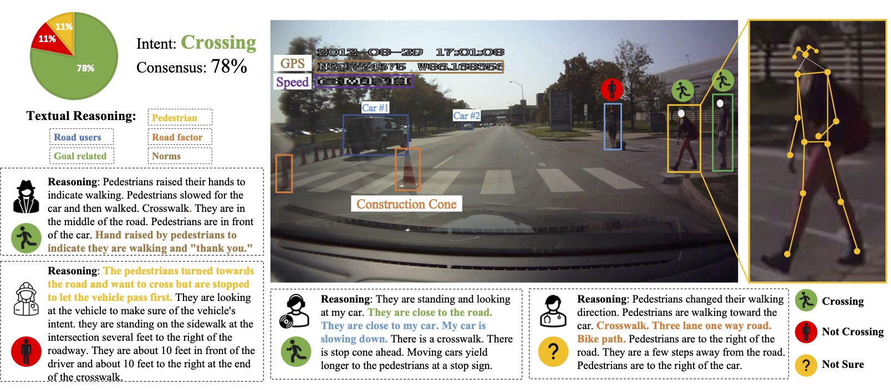
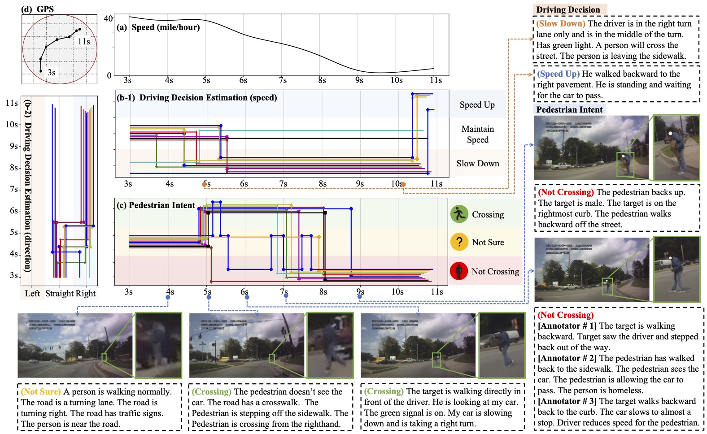
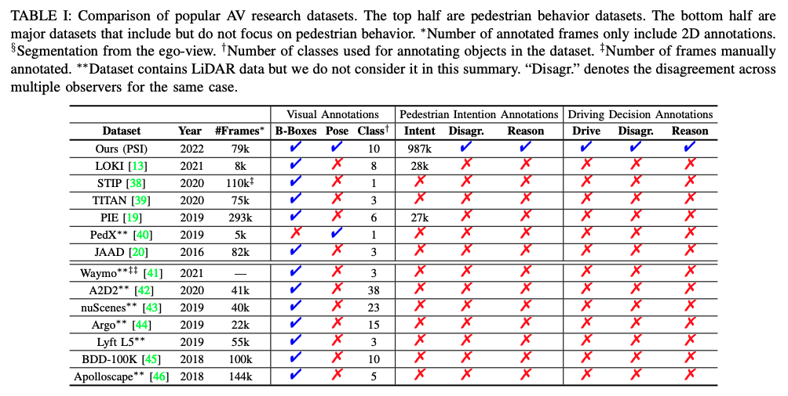

# Pedestrian Situated Intent (PSI) Bencharmark

This Repository contains the scripts and instructions about preparing the **Pedestrian Situated Intent (PSI) 1.0 & 2.0** dataset. 




- **PSI 1.0**: video_0001 ~ video_0110
- **PSI 2.0**: video_0001 ~ video_0204

**NOTE: You may only need to use PSI 2.0 dataset for the [[IEEE ITSS PSI Competition](https://psi-intention2022.github.io)]**. But the PSI 1.0 dataset is also provided, and feel free to use it if you would explore additional knowledge beyond the PSI 2.0.

# 1. PSI 2.0 Dataset

## Part 1. Prepare the dataset
***Step 1.*** Download the PSI 2.0 Dataset videos from [ [Google Drive](https://drive.google.com/drive/folders/1dKB1BZQNUB2D8uC-6WhvJzFk8tPXl5re?usp=sharing)]. Move *\*.zip* files to the dataset *ROOT_PATH*, and unzip them by 

```shell
    cd ROOT_PATH # e.g., root/Dataset
    unzip '*.zip' -d .
    rm *.zip
```
The extracted folder contains all videos (Train/Val):
-  *ROOT_PATH/PSI_Videos/videos*.

***Step 2*** Download PSI 2.0 data annotations from [[Google Drive](https://drive.google.com/drive/folders/1NXuAh_fW7hLofaOffl_eDeD3l84d_4Jj?usp=sharing)]. Move downloaded *\*.zip* files to the dataset *ROOT_PATH*.

```python
    unzip '*.zip' -d .
    rm *.zip
```

The extracted folder contains all annotations of the PSI 2.0 Dataset (Train/Val)
- *ROOT_PATH/PSI2.0_TrainVal/annotations/cognitive_annotation_key_frame*
- *ROOT_PATH/PSI2.0_TrainVal/annotations/cv_annotation*

and the train/val/test splits:
- *ROOT_PATH/PSI2.0_TrainVal/splits/PSI2_split.json*.


***Step 3*** Split the videos into frames by

```shell
    python split_clips_to_frames.py *ROOT_PATH*
```
and the output frames are saved as:
- *ROOT_PATH/frames*.


## Part 2. Extend Key-frame Cognitive Annotations

**TASK 1 -  Pedestrian Intent**: The frame at which one annotator explicitly make a cross intent annotation is treated as the "key-frame". Every annotator would give one "intent" annotation about the crossing intent estimation of the target pedestrian, together with one "reansoning/explanation" of the estimation. For these two annotation: 

- Crossing Intent: We extend the crossing intent annotation to the frames following the current key-frame, until the next frame that one of the annotators make another estimation (no matter if the two annotations are the same or not).
- Reasoning/Explanation: We extend the reasoning/description of the intent estimation to the frames prior to the current key-frame, until the last key-frame that one of the annotators made another estimation, assuming the description is about the scenes observed by the annotators to support the intent estimation.

*Already-crossed*: When a pedestrian has already crossed in front of the moving vehicle, we categorize the status after the target pedestrian crosses the middle line of the ego-view as "*Already-crossed*." In this scenario, there is no necessity to predict any further crossing intent, as the target pedestrian has already safely crossed the road.


```shell
    python extend_intent_annotation.py *ROOT_PATH*
```
and the output frames are saved as:
- *ROOT_PATH*/PSI2.0_TrainVal/annotations/cognitive_annotation_extended.

**TASK 2 -  Pedestrian Trajectory**: Pedestrian trajectory prediction task uses only the visual annotations (bounding boxes) of the target pedestrian, there is no need to exntend the cognitive annotations to all frames. 

**TASK 3 -  Driving Decision**: The frame at which one of the annotators explicitly make a driving decision is treated as the "key-frame". Every annotator would give one "decision" at the key-frame, and provide one "reansoning/description" of the decision made. For these two cognitive annotations: 

- Driving Decision: We extend the driving decision annotation to the frames following the current key-frame, until the next frame that one of the annotators make another driving decision (e.g., turn or go straight).
- Reasoning/Description: We extend the reasoning/description to the frames prior to the current key-frame, until the last key-frame that one of the annotators made another estimation, assuming the description is about the scenes observed by the annotators to support the driving decision.

```shell
    python extend_driving_decision_annotation.py *ROOT_PATH*
```
and the output frames are saved as:
- *ROOT_PATH*/PSI2.0_TrainVal/annotations/cognitive_annotation_extended.



## Part 3. Baselines for Different Tasks Using the PSI Dataset 

We provide baselines for all tracks of challenges as hints about using the PSI 2.0 dataset for a quick start. 

***Track 1 ([Pedestrian Intent Prediction (PIP)](https://github.com/PSI-Intention2022/PSI-Intent-Prediction.git))***

***Track 2 ([Pedestrian Trajectory Prediction (PTP)](https://github.com/PSI-Intention2022/PSI-Trajectory-Prediction.git))***

***Track 3 ([Driver Decision Prediction (DDP)](https://github.com/PSI-Intention2022/PSI-DriverDecision-Prediction.git))***


# 2. PSI 1.0 Dataset

If you would like to use the PSI 1.0 dataset annotations, download PSI 1.0 data annotations from [[Google Drive](https://drive.google.com/drive/folders/1u0kErzPPdhd4Y7yQ9DRBtP5PirbtbKzY?usp=sharing)]. Move downloaded *\*.zip* files to the dataset *ROOT_PATH*.

```shell
    unzip '*.zip' -d .
    rm *.zip
```

The extracted PSI 1.0 dataset follows the same format as PSI 2.0, so feel free to use the *Cognitive Annotation Extention* scripts and *Baselines* prepared for PSI 2.0 to explore the PSI 1.0 knowledge. 

(*Note:* PSI 2.0 and PSI 1.0 share the first 110 videos, but have different annotations. Please check the [[paper](https://arxiv.org/pdf/2112.02604v2.pdf)] and our future udpates for more information. )